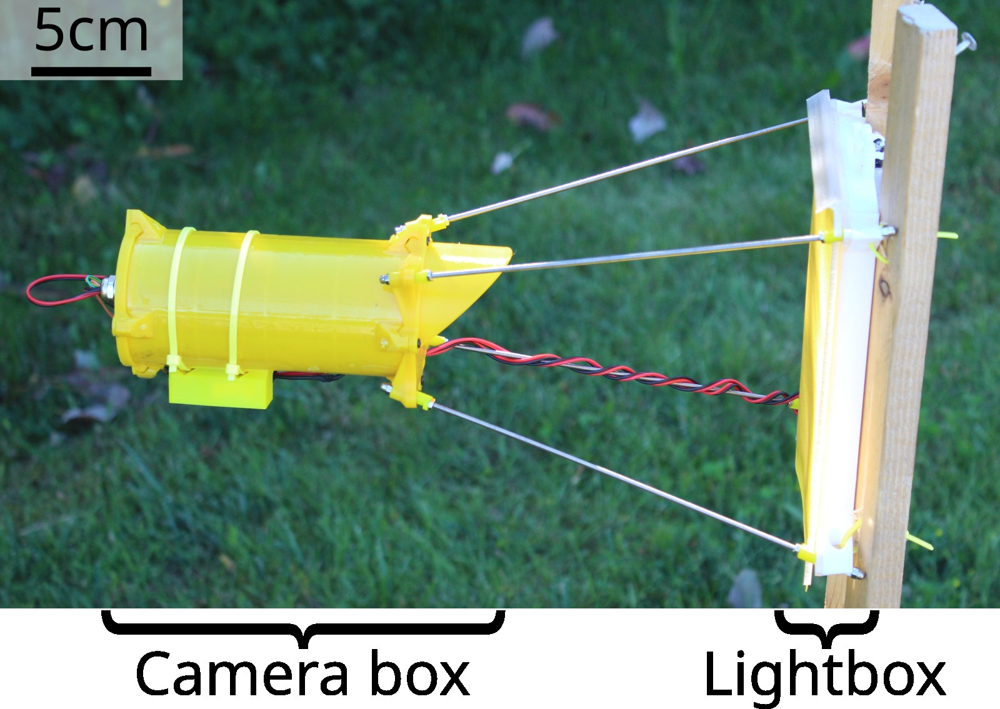

# Hardware{#hardware}

This page describes how to build a Sticky Pi. It involves familiarity with 3D printing, electronics, DIY, ...
First, we present an short overview of the device itself.
Second, we describe the "assembly graph" to construct it from basic parts.
Third, we present the minimal attachments/modules needed to test abd operate it (battery, sticky card holder).
We are working on streamlining the assembly process towards a more 'off-the-shelf tool', but are generally happy to collaborate and help building devices -- do not hesitate to [contact us](/community#contact).


## Overview{-}

As shown here, Sticky Pis have two main part, the *camera box*, which contains all the electronic and the camera, and the *lightbox*, which works like a backlight when images are taken.
These two parts are connected by metal rods.

```{r hardware-overview, fig.cap="Assembled and deployed Sticky Pi, version 2", echo=FALSE}

```

The complete list of parts and consumables required (i.e. Bill Of Material) is available [here](https://github.com/sticky-pi/sticky-pi-device/blob/main/hardware/BOM.csv).
The first part is a custom board, the Sticky Pi Hat, that we designed to simplify the assembly process.
This board has its [own BOM](https://github.com/sticky-pi/sticky-pi-device/blob/v2/hardware/sticky_pi_hat/pcbway_BOM.xls).
The KiKad project (including schematics) and Gerber files are available [here](https://github.com/sticky-pi/sticky-pi-device/tree/main/hardware/sticky_pi_hat) .
The Sticky Pi Hat and can be readily machine-assembled in a factory. We are happy to assist users with ordering.


## Assembly graph{-}

We decided to describe the assembly process as an interactive graph.
The assembly process goes from the top down.
Each part, is a rectangle that you can click on to access its documentation.
Each diamond shape, is a "process", which you can click on to show a video and written description.


```{=html}
<input id="search-bar"/>
<div class="container-fluid">
  <div class="row">
    <div id="doc-graph" class="col-lg-7 min-vh-100">

    </div>

    <div id="doc-info" class="col-lg-5">

        <h1> <span>Interactive building instructions</span></h1>
        <div class="init_only">
            <p>
                this is some init
            </p>
        </div>
    <div class="process_only">
        <video id='video' controls="controls" preload='none' width="250">
        <source id='mp4' src="http://media.w3.org/2010/05/sintel/trailer.mp4" type='video/mp4' />
        </video>
    </div>


        
        <div id="description">
        </div>
        <div id="note">
        </div>
        <div id="process-asset" class="process_only">
        </div>


        <div id="footer" class="part_only">
            <p> <a  target="_blank" id="link">Link</a>. Estimate (per device) = $<span id="price"></span> </p>
        </div>
    </div>
  </div>
</div>
```
