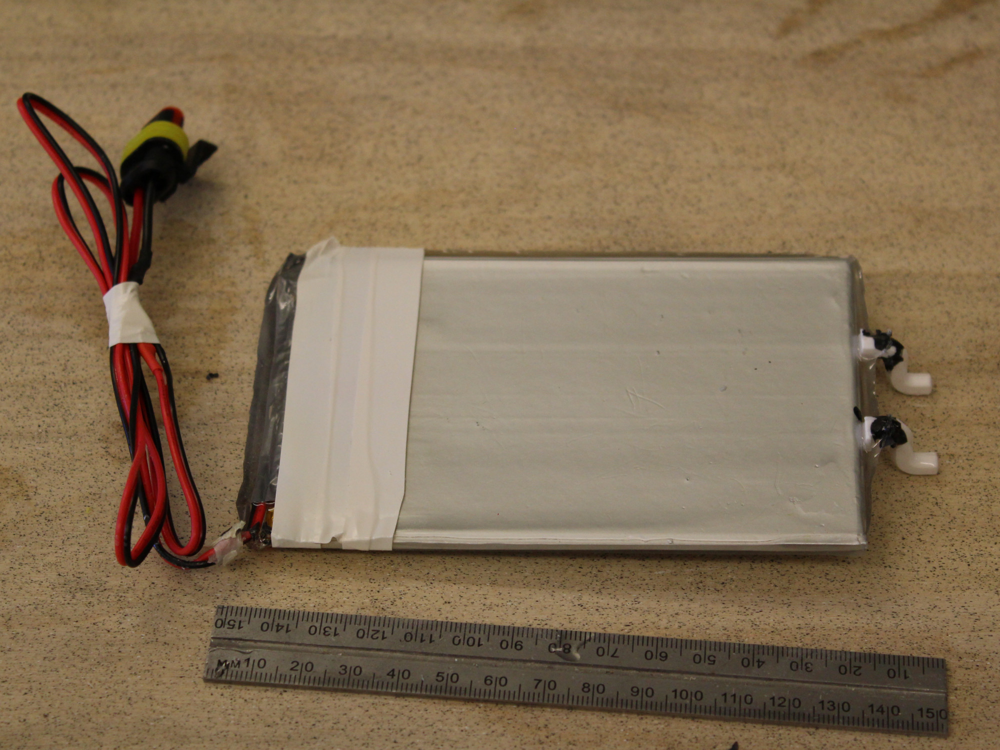
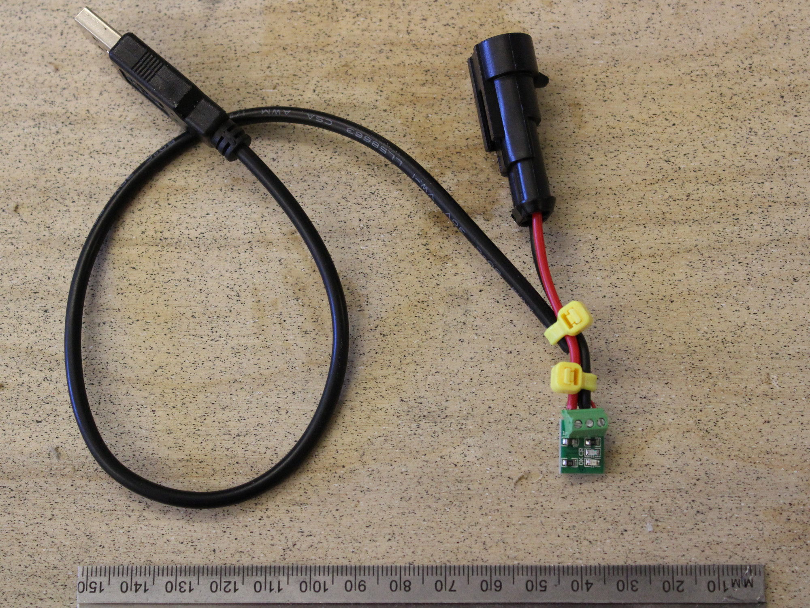
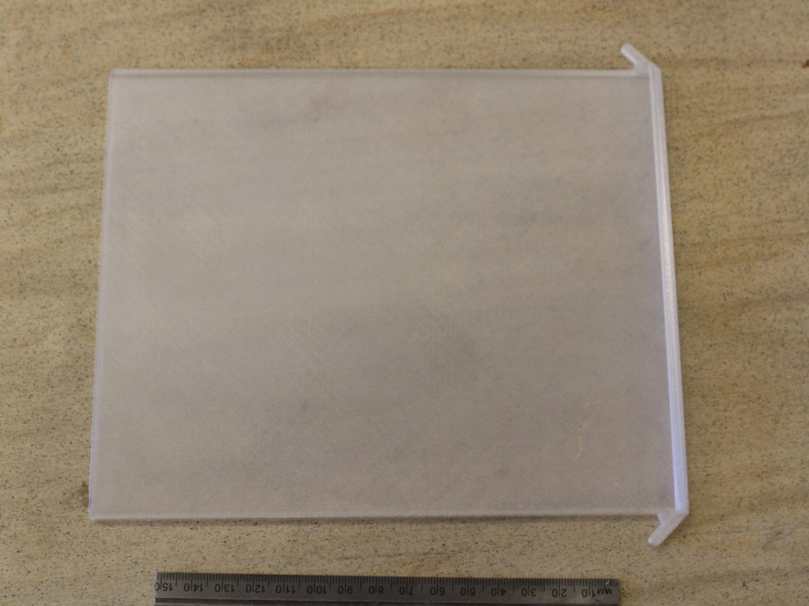
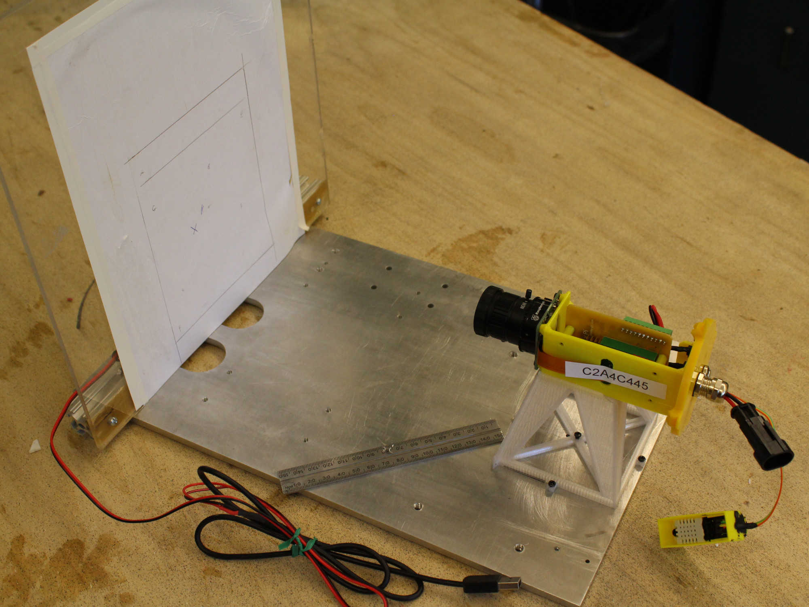

# Hardware{#hardware}

This page describes how to build a Sticky Pi. It involves familiarity with 3D printing, electronics, DIY, ...
First, we present an short overview of the device itself.
Second, we describe the "assembly graph" to construct it from basic parts.
Third, we present the minimal attachments/modules needed to test abd operate it (battery, sticky card holder).
We are working on streamlining the assembly process towards a more 'off-the-shelf tool', but are generally happy to collaborate and help building devices -- do not hesitate to [contact us](/community#contact).


## Overview{-}

As shown here, Sticky Pis have two main part, the *camera box*, which contains all the electronic and the camera, and the *lightbox*, which works like a backlight when images are taken.
These two parts are connected by metal rods.

```{r hardware-overview, fig.cap="Assembled and deployed Sticky Pi, version 2", echo=FALSE}
knitr::include_graphics("assets/hardware/overview.jpg")
```

The complete list of parts and consumables required (i.e. Bill Of Material) is available [here](https://github.com/sticky-pi/sticky-pi-device/blob/main/hardware/BOM.csv).

### Custom Board{-}
The first part is a custom board, the Sticky Pi Hat, that we designed to simplify the assembly process.
This board has its [own BOM](https://github.com/sticky-pi/sticky-pi-device/blob/v2/hardware/sticky_pi_hat/pcbway_BOM.xls).
The KiKad project (including schematics) and Gerber files are available [here](https://github.com/sticky-pi/sticky-pi-device/tree/main/hardware/sticky_pi_hat) .
The Sticky Pi Hat and can be readily machine-assembled in a factory. We are happy to assist users with ordering.

### 3D-printed parts{-}
All 3d printed parts are available on [our Onshape repository](https://cad.onshape.com/documents/73922dc6e3c6d7006b309c14/w/7e4fb88a2e93b6adba33fd5a/e/0158242481e994e0d179a90f).
Snapshots of individual stl files are also on our github [here](https://github.com/sticky-pi/sticky-pi-device/blob/main/hardware/CAD)


## Assembly graph{-}

We decided to describe the assembly process as an interactive graph.
The assembly process goes from the top down.
Each part, is a rectangle that you can click on to access its documentation.
Each diamond shape, is a "process", which you can click on to show a video and written description.


```{=html}
<input id="search-bar"/>
<div class="container-fluid">
  <div class="row">
  <div id="doc-graph" class="col-lg-7 min-vh-100" style="background:PapayaWhip;">

    </div>

    <div id="doc-info" class="col-lg-5">

        <h1> <span>Interactive building instructions</span></h1>
        <div class="init_only">
            <p>
                Navigate and click on the graph to display instructions
            </p>
        </div>
    <div class="process_only" style="display: none;">
        <video id='video' controls="controls" preload='none' width="250">
        <source id='mp4' src="" type='video/mp4' />
        </video>
    </div>


        
        <div id="description">
        </div>
        <div id="note">
        </div>
        <div id="process-asset" class="process_only">
        </div>


        <div id="footer" class="part_only">
            <p> <a  target="_blank" id="link">Link</a>. Estimate (per device) = $<span id="price"></span> </p>
        </div>
    </div>
  </div>
</div>
```


## Modules{-}

In addition to the Sticky Pi itself, in most cases, you will need a power module (e.g. a battery), and a support to hold sticky cards.
Here, we describe these two essentials, as well as the station we designed to test devices.

### Battery module{-}

Sticky Pis can accommodate various power solutions -- as long as you provide 3.5-6V continuous current, and at least 500mA.
Power needs to be provided through a female 2-pin auto connector (that matched the sticky Pi male connector), often you would just buy them in pairs.
What battery you pick depends on your use case, In some cases you can also adapt a USB cable to provide 5V to sticky pis without a battery (e.g. in a lab or a green house).
The top of the lightbox exposes a flexible attachment we intended for batteries.

In most of our use cases, we opted for off-the shelf tablet lithium ion batteries such as [this one](https://www.aliexpress.com/item/32791077730.html?spm=a2g0o.order_list.0.0.4e4a18023yvNSH).
Then we encased the batteries battery in epoxy with [custom pegboard pins](https://cad.onshape.com/documents/73922dc6e3c6d7006b309c14/w/7e4fb88a2e93b6adba33fd5a/e/e36f0fdef7738a73acea5bae) to hang the it on the light box:

```{r battery-module, fig.cap="Battery module", echo=FALSE}

```

In order to charge the batteries, we modified [solar panel chargers](https://www.aliexpress.com/item/33034581059.html?spm=a2g0o.order_list.0.0.4e4a18023yvNSH):

```{r battery-charger, fig.cap="Simple battery charger", echo=FALSE}

```

In our experience, 5000mAh batteries lasted approximately 10 days (depending on the weather).

### Sticky Card Drawer{-}

Instead of sticking sticky cards directly on the lightbox, we **strongly recommend** using "drawers" on which you can pre-stick a card
and swap drawers in and out. The printed drawers look like this:

```{r card-drawer, fig.cap="Sticky card drawer", echo=FALSE}

```

The part for the drawer is available on [our Onshape repository](https://cad.onshape.com/documents/73922dc6e3c6d7006b309c14/w/7e4fb88a2e93b6adba33fd5a/e/0158242481e994e0d179a90f).
You can also just download the [STL file](https://github.com/sticky-pi/sticky-pi-device/blob/main/hardware/CAD/card_drawer.stl).
Note that you need a **transparent material**.
You can also make a drawing from the Onshape part and laser-cut a of acrylic to do the job.

### Testing Station{-}

The testing station is used to adjust the focus of devices.
It consists of two main parts: a testing tower, on which the "sledge" rests, and a perpendicular plane at the same distance as the sticky card would be:

```{r testing-station, fig.cap="Sticky Pi testing platform", echo=FALSE}

```

To adjust the camera's aperture, we can attach a lightbox in the back of the vertical wall ad manually turn it on with a modified USB cable.
The precise dimensions of this platform are available on [Onshape](https://cad.onshape.com/documents/73922dc6e3c6d7006b309c14/w/7e4fb88a2e93b6adba33fd5a/e/782e9337fe653799ee4f3028).
