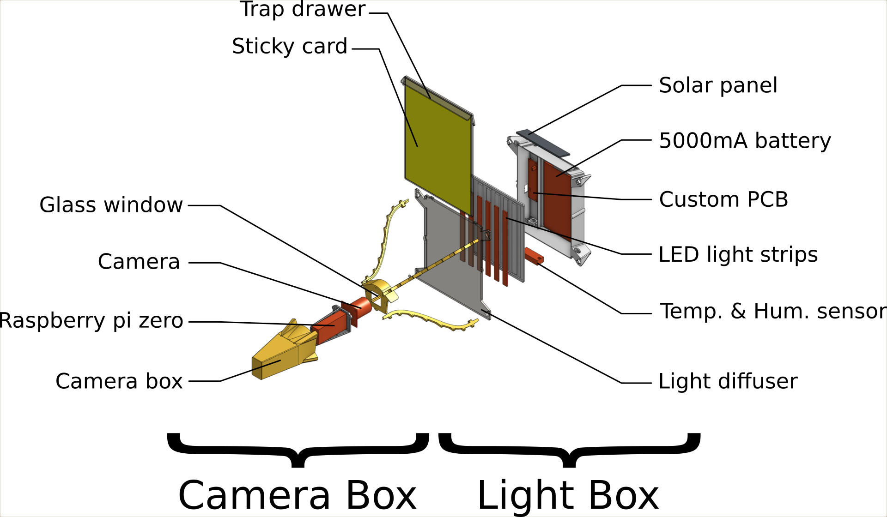
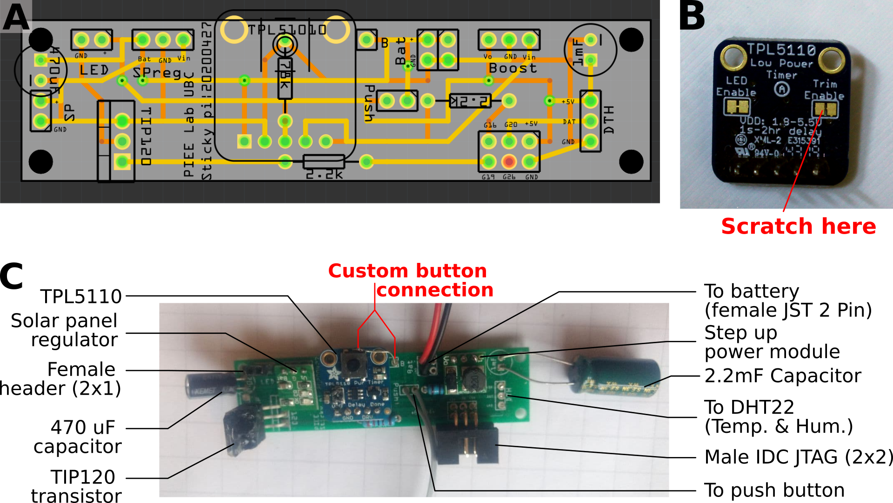
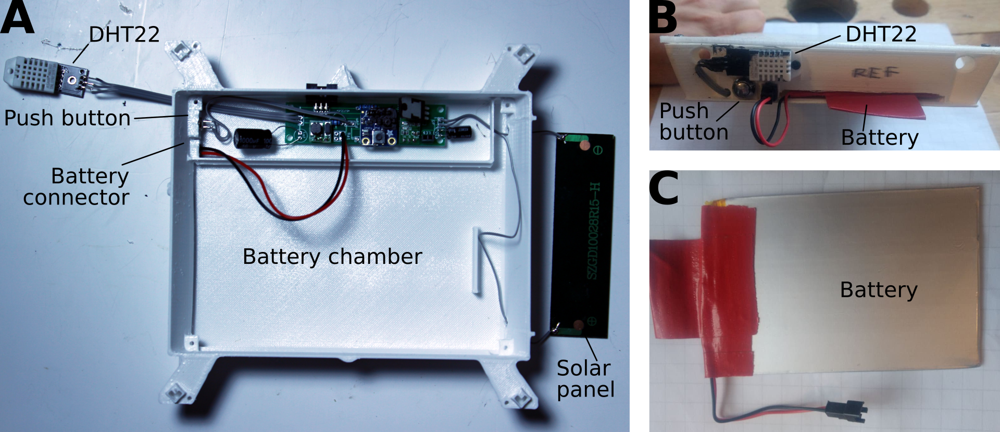

# Hardware{#hardware -}

This page describes how to build the two main components of the hardware:
the *Sticky Pi Device* and the *Data Harvester*.
Briefly, multiple Sticky Pis are deployed in the field. Each device stores its images on its own SD card.
On a regular basis (*e.g.* weekly), experimenters use a data harvester to retrieve the data from multiple devices.
Silently, the data harvester also syncs the location and time of the devices it communicates with.
One Data Harvester may be used to maintain multiple traps. Multiple Data Harvesters can exist in the same platform (*e.g.* five experimenters, one harvester per experimenter, ten devices per experimenter).


This section involve familiarity with 3D printing, electronics, DIY, ... 
We are working on streamlining the assembly process towards a more `off-the-shelf tool', but are generally happy to collaborate and help building devices -- do not hesitate to [contact us](/community#contact).

## Device{-}
### Overview{-}
<!--  -->
```{r device-overview, fig.cap="Sticky Pi Device", echo=FALSE}

```
As you can see in Figure \@ref(fig:device-overview), the device has two main parts, which are connected with a ribbon cable: the *camera box* and the *light box*. 

A complete description of the parts, price and reference is available in our [Bill of Material](https://github.com/sticky-pi/sticky-pi-device/blob/main/hardware/BOM.csv)

Note that all 3D-printed parts are available on [our onshape repository](https://cad.onshape.com/documents/73922dc6e3c6d7006b309c14/w/7e4fb88a2e93b6adba33fd5a/e/708b4c330014fa7fbda6bdeb) where they can be exported in a variety of formats.

You can also take a look at [our schematic](assets/spi_schematic.svg).

### Assembly{-}
The camera Box and light box can be assembled separately and swapped between devices (*i.e.* the light box acts as a plug and play module for the camera box).

#### Camera box{-}

```{r camera-box-breakdown, fig.cap="Needed parts for the camera box", echo=FALSE}
knitr::include_graphics("assets/camera_box_breakdown.png")
```

1. Burn [our OS image](https://todo.com) onto the SD card (note you can also make your own from scratch image by adapting[the scripts in](https://github.com/sticky-pi/sticky-pi-device/tree/main/software)).
```{block, type='rmdwarning'}
**Danger Zone!** Ensure you know what you are doing here. In particular, give the path to the correct drive otherwise you may wipe out the wrong drive, and *lose data*. On Unix-like systems, use `lsblk` to see all drives.
```
To burn an SD card use [our script](https://github.com/sticky-pi/sticky-pi-device/blob/main/software/burn_image.sh) like `sh burn_image.sh -i <PATH_TO_LOCAL_IMAGE> -d <DEVICE>`, where `<PATH_TO_LOCAL_IMAGE>` is the OS image you just downloaded, and `<DEVICE>` the SD card location `e.g. /dev/mmcblk0` -- you need [`etcher-cli`](https://github.com/balena-io/etcher-cli).

2. Prepare the Raspberry Pi.
```{r pi-modifs, fig.cap="Modifications to the Raspberry Pi Zero", echo=FALSE}
knitr::include_graphics("assets/pi_modifs.png")
```
    1. Solder 2x5 headers for the Real Time Clock on pins 1-10. Mount the clock (Figure \@ref(fig:pi-modifs)A).
    2. Solder directly the IDC right angle connector onto the board on pins 35-40 (Figure \@ref(fig:pi-modifs)A).
    3. On the back of the Raspberry pi board, use a jumper cable to solder GPIO pin 40 to +5V (this provides power to the Pi, Figure \@ref(fig:pi-modifs)B)
```{r pi-sledge, fig.cap="Mounting the Raspberry Pi on the sledge", echo=FALSE}

```
    4. Use four screws to mount the pi on the "Pi sledge". Plug the ribbon cable for the camera (Figure \@ref(fig:pi-sledge)A).
    5. Fold the ribbon cable around the sledge as in the picture, and mount the camera with another four screws (Figure \@ref(fig:pi-sledge)B-C)
    5. Insert the OS SD card (burnt as described above)
    6. Focus the camera. For those who want to assemble multiple devices, we recommend a "camera focusing station" that can adapt a Pi sledge and has a display, keyboard... This way, one can use [raspivid](https://www.raspberrypi.org/documentation/usage/camera/raspicam/raspivid.md) in preview mode to check focus and alignment.
    6. Initialize your device (you can do that at the same time as focusing), which you can do with the [Data harvester](#data-harvester):
        1. Power the data harvester, and ensure the time is set (not it is in GMT/UTC). 
        2. Plug it to the pi's USB port. 
        3. Boot/power the pi. 
        4. The data harvester should then display information, including **the unique ID of the pi**. It will be an eight-digit hexadecimal number (e.g. `abcd0123`). Make a couple of physical label with this tag and stick them to the box (and write them on the sledge).
        5. As part of the communication process, the **clock of the raspberry pi will be updated** (indeed the factory RTC is unset)
    7. Thread the 1x6 ribbon cable (it should be at least 50cm long) through the "camera box" **before** clamping the 2x3 IDC connector on each side. **You want have the two connectors in the same orientation** (i.e. a wire connect pin 1 of the left connector to pin 1 o the right connector -- and *not* pin 6):
    
    8. Plug the ITC connector on the Pi GPIO, and gently slide the Pi sledge inside the camera box, while pulling the slack cable from the outside. Note, at the stage, you can also add some desiccant inside the box to reduce fogging.
    9. Assemble the "camera box lid":
```{r glass-window, fig.cap="Assembly of the camera box lid", echo=FALSE}
knitr::include_graphics("assets/glass_window.png")
# \@ref(fig:xxxx)
```
        1. Cut a glass microscope slide into a 25x25mm square with a glass cutter (e.g. with a [3d printed gauge and snaping tool](https://cad.onshape.com/documents/73922dc6e3c6d7006b309c14/w/7e4fb88a2e93b6adba33fd5a/e/3f9dffd97a216a2d1bbd77ce) and tool it takes just a few seconds,  Figure \@ref(fig:glass-window)A-C).
        2. Place the glass window on the slot, use masking tape or duct tape to cover the central area and the back. Cast a layer of epoxy resin, and let it set for a day this will embed the glass in the lid. Note that it makes sense to make multiple lids at the same time and avoid wasting time and epoxy (Figure \@ref(fig:glass-window)D-E).
        3. Clean the lid. Optionally coat it with water repellent such as [Rain-X](https://www.rainx.com/)
    10. Add calk at the junction between the lid and the box, screw the lid on the box. Also use calk to seal the 6x1 ribbon cable outlet.
    11. Coat the whole box with a layer of epoxy (note you can also chose to do that before assembly)

    
#### Light box{-}


1. Assemble our custom PCB:
```{r custom-board, fig.cap="Assembly of the custom PCB", echo=FALSE}

# \@ref(fig:custom-board)
```
    1. Manufacture/order the PCB from the [gerber files](https://github.com/sticky-pi/sticky-pi-device/tree/main/hardware/main_gerber) (Figure \@ref(fig:custom-board)A)
    2. Prepare the timer (scratch the board to disable the built-in potentiometer) -- (red in Figure \@ref(fig:custom-board)B).
    3. Solder all parts to the board. This should be fairly self explanatory from the labels (Figure \@ref(fig:custom-board)C).
    3. Make a custom connection to our push button (red in Figure \@ref(fig:custom-board)C). This is arguably a bit of a hack, but that allows us to mimic the built-in TLP5110 push button, with our own.
    3. Thread the push button (before soldering it, not to twist the cables)
    5. Screw the PCB to the bottom of the light box (be careful not to split the material, do not hesitate to use shorter screw). 
```{r light-box, fig.cap="Assembly of the custom PCB", echo=FALSE}

# \@ref(fig:light-box)
```
    6. Insert the battery connector (Figure \@ref(fig:light-box)A)
    7. Screw the Humidity and temperature sensor to the outside the box (Figure \@ref(fig:light-box)A-B).
    8. Glue the solar panel in the top slot
    
2. Assemble the light diffuser:
```{r light-diffuser, fig.cap="Assembly of the custom PCB", echo=FALSE}
knitr::include_graphics("assets/light_diffuser.png")
# \@ref(fig:light-diffuser)
```
    1. Cut six 5V, white, led light strips (Figure \@ref(fig:light-diffuser)A).
    2. On one side, cut away the + pad, and the - on the other side.
    3. Align all the + pads on the top, and solder them together, in parallel, with a transverse wire
    4. Solder the 1x2 header to be connected to our PCB as in the picture (the male pins will be protruding downward). Use superglue to glue the header to the diffuser (Figure \@ref(fig:light-diffuser)B).
3. Test setup: Connect a camera box, using the 1x6 cable. Plug the light diffuser (or just a placeholder 5v LED light for now). Plug a battery. You should see the LED of the timer glowing (if not, press the push button to force reset the timer). After less than a minute, the The flash should be triggered, and the timer should shut down. Pressing the push button should restart the whole process. If left untouched, this should happen every 20min, approximately.

             
### QC and troubleshooting{-}
Controlling the assembly before deployment in the field will save you a lot of trouble.
A few suggestions:

1. Plug all devices, and press the push button to initiate the image acquisition. 
2. Ensure all devices flash. **The light should blink twice**. 
    * If the light does not blink. Check power/timer/light connection
    * If the light blinks more than twice, the device is reporting an error.
    Typically, the camera cannot be found.
    
3. Plug the Data Harvester and boot a device you want to test. Data transfer should be initiated. 
    * Check the label of the pi matches the ID displayed by the harvester.
    * Monitor image transfer.
4. Once all devices have been harvested, retrieve the memory stick of the harvester and inspect the content.
    * There should be one directory for each device
    * Each directory contains all the pictures for this device and **a log file**
    * Open the log file to check no errors were reported
    * The name of each image contains the time in UTC. Ensure the time is correct.
    * Open the images to check exposure, focus,...
    * The environmental data (temperature, relative humidity, GPS coordinates and other meta variables) are encoded in the exif metadata inside the "Make" field (Sometime, though rarely, the temperature/humidity sensor fails, so you may have missing values).


### Use{-}

## Data harvester{-}
The data harvester is a portable tool to retrieve the data from the Sticky Pis.
It is a (micro) computer running custom server that are available to the devices through a wifi network (hotspot).  
```{r device-overview, fig.cap="Sticky Pi Harvester schematic", echo=FALSE}

```
Figure \@ref(fig:data-harvester) show how the different hardware parts interact.
The parts we used are described in the [Bill of Material](https://github.com/sticky-pi/sticky-pi-data-harvester/blob/main/hardware/BOM.csv).


### Rapsberry Pi{-}
1. Download our [our OS image](https://todo.com) and burn it on an SD card
1. Format the memory stick to make a single ext4 partition
1. In the new partition you created, create a file names `.api-credentials.env` and fill it with:
```sh
SPI_API_HOSTNAME=<the hostname of the API server>
SPI_API_USERNAME=<a username for this data harvester>
SPI_API_PASSWORD=<the password for this data harvester>
```
This will allow the data harvester to automatically upload the new images to your sever. This implies you have set up a server, and have created at least one user, which is described the [webserver section](/web-server).


### Router{-}

1. Set the name of the wifi network to `sticky-pi-net`, and the password to `sticky-pi` (this is to match the devices' [environment variables](todo)). 
1. Ensure the subnet is `192.168.8.` (the ip address of the router should then be `192.168.8.1`).
1. Write down the MAC address of the Raspberry Pi ethernet port (you can do that by using the `ifconfig eth0` command, and spot a six-fields number looking like `aa:db:e1:00:01:23`).
1. In the DNS menu reserve the IP address `192.168.8.2` to the mac address of the eth0 port you just retrieved

### Assembly{-}
A simple way to make the divice is to connect the parts according to the schematics, and arrange them in a 


### Use{-}


