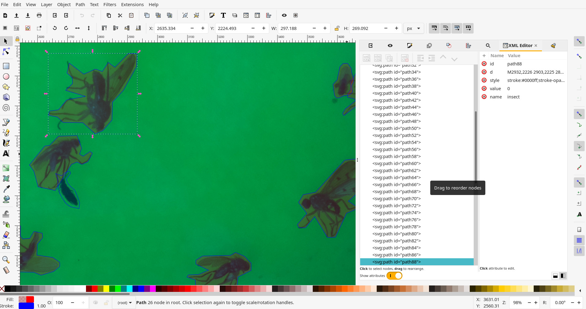

# Machine Learning{#ml}

<!--  TODOS: -->
<!-- * merge git -->
<!-- * re-upload UID model -->
<!--   * comment config inline -->
<!-- * re-upload SIM model -->


This page describes how to annotate, train and use the machine learning model of the Sticky Pi project.
This step *does* require some familiarity with scientific computing (e.g. Unix/Linux, [python](https://en.wikipedia.org/wiki/Python_(programming_language), ...).
Here, we complement the descriptions of the algorithms provided in the [Sticky Pi manuscript](`r PUBLICATION_URL`) with a practical documentation on how to use and adapt them.
We are open for collaboration regarding training, building and extending Machine Learning models, so do not hesitate to [contact us](/community#contact). 
For simplicity, we describe the how to use the ML tools independently of the API (which is set to store and query images/annotations on a remote or a local machine). For production, with multiple concurrent Sticky Pi devices, we recommend using the API.


## General description{-}

Briefly, we start from a series of images (every 20min, for several day) of a sticky card.
Our ultimate goal it to tell *which*, and *when* insects were captured.
We break down this task in three independent steps:

1. [**Universal Insect Detector**](#uid) -- We perform an [instance segmentation](https://en.wikipedia.org/wiki/Image_segmentation#Groups_of_image_segmentation) on all images independently. This extracts insects (foreground) from the background. Importantly, at this stage, we do not yet classify insects.
2. [**Siamese Insect Matcher**](#sim) -- Captured insect actually may move, degrade, become occluded... Therefore, in practice, classification and timing of capture from single images would be very inconsistent in time. Instead, we first track insects through time before classifying them. The function of the Siamese Insect Matcher is to track multiple insect instances through their respective timelapses.
3. [**Insect Tuboid Classifier**](#itc) -- After tracking, each insect in the time series is represented by a variable number of standardized segmented shots as well as metadata (including size) -- which we call a "tuboid". The Insect Tuboid Classifier infers a taxonomy to each tuboid based on multiple images.


Below, we describe how to implement each step. The model files and datasets used in the publication are available on [Zenodo](https://zenodo.org/record/4680119). Our source code is publicly available on [github](https://github.com/sticky-pi/sticky-pi-ml).

## General Prerequisites{#prerequisites -}

### Installation{-}

We recommend starting by setting a [Python virtual environment](https://docs.python.org/3/tutorial/venv.html) for the entire project. 
And using the python package manager (pip).

#### Detectron2, PyTorch and PyTorch Vision{-}

In your virtual environment, you want to manually install [detectron2](https://detectron2.readthedocs.io/en/latest/tutorials/install.html), [which requires **matching** PyTorch and Torchvision](https://detectron2.readthedocs.io/en/latest/tutorials/install.html#install-pre-built-detectron2-linux-only). This has to be done manually since it depends on your platform/hardware (e.g. GPU support).


For instance, on a Linux machine *without* CUDA (so, no GPU support)

```sh
# installing precompiled PyTorch and Torchvision (from at https://pytorch.org/)
pip3 install torch==1.10.1+cpu torchvision==0.11.2+cpu torchaudio==0.10.1+cpu -f \
    https://download.pytorch.org/whl/cpu/torch_stable.html
# then installing detectron2
pip3 install detectron2 -f \
    https://dl.fbaipublicfiles.com/detectron2/wheels/cpu/torch1.10/index.html
```

*Note, to make the most of [CNNs](https://en.wikipedia.org/wiki/Convolutional_neural_network) and PyTorch, you likely want to have hardware support (i.e. a GPU). Running models on a CPU is mostly for testing and development, and may be very slow (in particular for training).*

#### `sticky-py-ml`{-}

Once you have installed `detectron2` (along with PyTorch and PyTorch Vision), you can install our package and its dependencies.

```sh
git clone https://github.com/sticky-pi/sticky-pi-ml.git --depth=1
cd sticky-pi-ml/src
pip install .
```


### Project organisation{-}
In the Sticky Pi project, the resources for each of the three algorithms described above (i.e.  UID, SIM and ITC) are stored and organised in a **"Machine learning (ML) bundle"**.
An ML bundle is a directory that contains everything needed to train, validate and use a tool.
ML bundles all contain the subdirectories:

* `config` -- one or several `.yaml` configuration files
* `data` -- the training and validation data
* `output` -- the trained model (i.e. `.pth` files). The file `model_final.pth` being the working model used for inference.


## Universal Insect Detector{#uid -}

The goal of (Universal Insect Detector) UID is to find and segment all individual insects from arbitrary sticky card images.
As part of the sticky-pi-ml package, we have made a standalone tool version of the UID, `standalone_uid.py` (see `standalone_uid.py --help`).
From within your virtual environment, you can use this tool (it should be in your path after installation) to segment images as well as re-train and validate the model on your own data.

We can start by downloading the whole ML Bundle from Zenodo (that can take a while as we are getting both the model and the data):

```sh
wget https://zenodo.org/record/4680119/files/universal-insect-detector.zip
unzip universal-insect-detector.zip
# show what is inside this new directory
ls universal-insect-detector
```

Our bundle directory is therefore `universal-insect-detector`.


### Inference{-}

For inference with the standalone tool, all images should be `.jpg` stored in a directory structure.
For this example, you could download a sample of three images we have put together for this tutorial.

```sh
wget https://doc.sticky-pi.com/assets/uid_tutorial.zip
unzip uid_tutorial.zip
ls uid_tutorial
```

Or just use the [download link](assets/uid_tutorial.zip)


```sh
# We use the uid tool to predict, based on a model located in the bundle `./universal-insect-detector` (--bundle-dir)
# We find all `.jpg` files in the target directory `./uid_tutorial` (--target)
# We set the verbose on (-v)
standalone_uid.py predict_dir --bundle-dir ./universal-insect-detector --target ./uid_tutorial -v
# list the generated resulting files
ls ./uid_tutorial/*.svg
```

As a result, the uid tool makes an SVG image for each JPG.
The SVG contains a path for each detected instance.
You can directly open the SVG files to check.
By default, the inference tool does not overwrite existing SVG, unless you use `--force`

### Training{-}

#### Data source{-}

In order to train the model, you need to populate the `universal-insect-detector/data/`.
For the UID, the input files are SVGs exactly like the ones outputted by the inference tool (i.e. a JPG image is embedded and each insect is a path).
You can either add new data to the existing collection of SVGs already present in `universal-insect-detector/data`,
or rebuild your own new set (though the later option would be rather labour-intensive).

A simple way to get started, is to run inference on your new images (as describe just above), and fix the resulting SVGs by hand.
Alternatively, you use the `--de-novo` option along with `--predict-dir` to just wrap your images in an empty SVG.
To edit the SVG, we recommend using [inkscape](https://inkscape.org/).
The default is that every insect is a simple, closed, path/polygon (e.g. made with the Bezier curve tool).
The stroke colour of the path defines the class of the object (the filling colour does not matter).
The default stroke colour for insects is in blue `#0000FF` (any other colour will not be recognised as an insect):




#### Configuration{-}

There are two configuration files:
* `mask_rcnn_R_101_C4_3x.yaml` -- the configuration for Mask-RCNN as defined in the `detectron2` documentation. This is the underlying segmentation algorithm we use.
* `config.yaml` -- The specific configuration for the Sticky Pi project (which may override some of the `mask_rcnn_R_101_C4_3x.yaml` configuration). See inline comments for detail.

The important configuration variables are likely going to be in the `SOLVER` section:

* `IMS_PER_BATCH` -- the number of images in a training bash. The larger this number, the more memory will be used during training. This will depend on your GPU capabilities.
* `BASE_LR` -- The starting learning rate
* `GAMMA` -- The decay rate of the learning rate, at every 'step'
* `STEPS`-- The training steps, in number of iterations. at each step, the learning rate will decrease (by a factor `GAMMA`)

#### Data integrity{-}

Before training, you most likely want to check your data can indeed be loaded and parsed.

```sh
standalone_uid.py check_data --bundle-dir ./universal-insect-detector -v
```
Read carefully the warnings, in particular if they hint that the SVG paths are malformed.

#### Training{-}

The training itself can be very long (e.g. several days on a GPU can be expected).
Likely, you have access to specialised hardware and support to do that.
Once you have set the configuration, checked the input data, etc, you can use the standalone UID tool to make a new model.


```sh
standalone_uid.py train --bundle-dir ./universal-insect-detector -v
```

The script will output information about the dataset and print a summary every 20 iterations (by default).
Each summary contains information such as `total_loss`, which should eventually decrease (this is described in the `detectron2` documentation).
Every 5000 iteration (defined in the configuration as `SOLVER/CHECKPOINT_PERIOD`) a snapshot of the ongoing model will be generated as `universal-insect-detector/output/model_XXXXXX.pth`, where `XXXXXX` is the iteration number.
Unless you have reached the maximal number of iteration, **you will need to manually copy your latest snapshot into the final working model `universal-insect-detector/output/model_final.pth`**.
You could use the intermediary snapshots to perform custom validation, or eventually remove them.

If you want to train the model from "scratch", use the `--restart_training` flag.
This will actually use Mask-RCNN model that was pretrained on the COCO dataset (training from zero would be much longer).


### Validation{-}

An important step is validation.
By default, each original image is allocated to either a validation (25%) or training (75%) dataset.
This is based on the checksum of the JPG image, so it is pseudorandom.
To compute validation statistics on 25% of the images that were "randomly" excluded from training, you can run:

```sh
standalone_uid.py validate --bundle-dir ./universal-insect-detector --target validation_results -v
```

This will run an inference on the validation set which has not been seen during training, create a resulting SVG files and issue summary statistics for each validation image (all in the target directory `validation_results/`).
In particular, there will be a result JSON file `results.json`, which contains a list where each element is a detected instance. Each instance has the fields:

* `area` -- the number of pixels in the instance
* `in_gt` -- whether the instance is in the ground truth
* `in_im` -- whether the instance is in the detected image
* `class` -- the class (*i.e.* `insect`)
* `filename` -- the SVG file where the image is from

You can then parse this file (e.g. in `R`) to compute summary statistics:

```R
library(data.table)
library(jsonlite)

dt <-

as.data.table(jsonlite::fromJSON('results.json'))
dt[, .(precision = sum(in_gt & in_im)/ sum(in_im),
		recall = sum(in_gt & in_im)/ sum(in_gt)),
	]
```


You can also compare the validation images (SVG) generated in the target directory (`validation_results/`).
Each path is a detected instance. The ones filled with  red (`#ff0000`) are detected by the UID, whilst the blue (`#0000ff`) ones are the ground truth.
I find it convenient to open images in inkscape and select, say a UID-generated path, right click and press "select same/fill and stroke" to then change the stroke style and colour to visualise better:


## Siamese Insect Matcher{#sim -}

The Siamese Insect Matcher is the second step of the analysis.
We start from a series of images annotated by the UID to generate "tuboids", which are series of shots of the same insect, over time.
To do that, we use Annotated Sticky Pi images. 
In the previous section, we described how to generate SVG images from JPGs in a directory.
The SIM is specific to Sticky Pi images as their timestamp is encoded in their name. 
The name of each image is formatted as `<device_name>.<datetime>.jpg`.
We also have a standalone tool to use the SIM `standalone_sim.py` (see `standalone_sim.py --help`).


### Inference{-}
For this documentation, we have made available a small series of 50 pre-annotated images.

First we download the images:

<!-- fixme todo -->

```sh
wget https://doc.sticky-pi.com/assets/sim_tutorial.zip
unzip sim_tutorial.zip
ls sim_tutorial
```

Or just use the [download link](assets/sim_tutorial.zip)

Using the standalone tool, you can then generate tuboids:

```sh
standalone_sim.py predict_dir --bundle-dir ./siamese-insect-matcher --target ./sim_tutorial -v
```

This should show progress and processing information.
As a result, you will find a directory named `tuboid` in `--target` (i.e. `./sim_tutorial`), with the following structure:

```
tuboids/
└── 15e612cd.2020-07-08_22-05-10.2020-07-09_13-27-20.1611328841-264f9489eac5c0966ef34ff59998084f
    ├── 15e612cd.2020-07-08_22-05-10.2020-07-09_13-27-20.1611328841-264f9489eac5c0966ef34ff59998084f.0000
    │   ├── context.jpg
    │   ├── metadata.txt
    │   └── tuboid.jpg
    ├── 15e612cd.2020-07-08_22-05-10.2020-07-09_13-27-20.1611328841-264f9489eac5c0966ef34ff59998084f.0001
    │   ├── context.jpg
    │   ├── metadata.txt
    │   └── tuboid.jpg
    .....................
     SKIPPING DIRECTORY WITH SIMILAR STRUCTURE
    .....................
    ├── 15e612cd.2020-07-08_22-05-10.2020-07-09_13-27-20.1611328841-264f9489eac5c0966ef34ff59998084f.0019
    │   ├── context.jpg
    │   ├── metadata.txt
    │   └── tuboid.jpg
    └── 15e612cd.2020-07-08_22-05-10.2020-07-09_13-27-20.mp4
```


The parent directory, `15e612cd.2020-07-08_22-05-10.2020-07-09_13-27-20.1611328841-264f9489eac5c0966ef34ff59998084f`, is formatted as: `<device_id>.<start_datetime>.<end-datetime>.<algorithm_unique_id>`.

The children directories are unique identifier of each tuboid in this specific series (ending in `.0000`, `.0001`, `.0002`, ...)
Inside each tuboid directory, there are three files:
* `metadata.txt` -- a small file describing each insect (parent image, x and y position, and scale)
* `tuboid.jpg` -- a JPG file where shots listed in metadata are represented as contiguous tiles. The file is padded with empty space when necessary
* `context.jpg` -- a compressed version of the first image containing the insect, where the insect is boxed (to show where and how large it is). This is mostly to give some context to the annotating team.


You will also find a video (`15e612cd.2020-07-08_22-05-10.2020-07-09_13-27-20.mp4`):


Note that each tuboid is shown by a rectangle with a number matching the unique identifier of a tuboid. 
This video can help you find a specific tuboid in the `tuboids` directory structure.
For instance, tuboid number 12 looks like this:


Also, the date and time are written on top of the video.

### Training{-}

The core algorithm of the Siamese Insect Matcher is a Siamese neural network. 
It compares insects from consecutive picture and learns to discriminate between the same instance vs. another insect. The data to train this network is a set of paired UID-annotated images, where insects that are the same instances are labeled as a group.
In practice, these are encoded as composite SVG images with the two images vertically stacked, and the instances labeled as an SVG group.

Rather than manually generating a training set, we can use the standalone tool to generate candidates for us that we can then just amend:

```sh 
standalone_sim.py make_candidates --filter 5  --target ./sim_tutorial -v
```

The argument `--filter 5` keep only every fifth image, and skip the others.
By default, this process will pre-group pairs of contours that highly overlap between consecutive images (based on their [IoU](https://en.wikipedia.org/wiki/Jaccard_index) only). This should save a lot of time as most of these should be simple cases.
This tool also draws a line to highlight paired groups. 
The line is simply a visual tool to help annotation and can be left as is:


Using [inkscape](https://inkscape.org/), you can group pairs using a shortcut like `CTRL+G`.
We recommend using the XML editor (the pannel on the right) to check grouping is correct, and find unmatched instances. 
Keep in mind that *not all instances can / should be matched*. 
Indeed, some insects may be mislabeled in a first place, or may have escaped, appeared/... 
It is unnecessary (and probably counterproductive) to try to manually fix the segmentation by adding or deleting new instance annotations (paths).

As before, you can either make your own data set, or just extend the existing SIM data bundle (the latter is recommended).

For the training itself, we can run:

```sh
standalone_sim.py train --bundle-dir ./siamese-insect-matcher -v
```
*On a machine with CUDA, you should use the `--gpu` flag*. 
Also you can use the `--restart-training` flag to restart from scratch rather than use the previous weights.

The training involves two preliminary stages that independently train separate branches of the network followed by a longer third (final) stage that trains the whole network. 
Every 200 rounds (default), the model takes a snapshot (i.e. saves the weights) in `siamese-insect-matcher/output/model_XXXXXX.pth`.
You can also manually the any `.pth` file as `model_final.pth` to specifically use this model during inference


### Validation{-}
Like for the UID, each original image is allocated to either a validation (25%) or a training (75%) dataset based on a checksum.
Validation is automatically computed to generate a loss and accuracy when training reches a checkpoit (by default, every 200 rounds). 
One can also specifically run validation:

```sh
standalone_sim.py validate   --bundle-dir ./siamese-insect-matcher --target ./sim_tutorial/validation/ -v
```

this will generate a json file `./sim_tutorial/validation/results.json`, which is a list of dictionaries
with fields `pred` (predicted score) and `gt` (ground truth, i.e. 0 or 1).
`pred` is the raw match score, so one can use this result file to vary the the match threshold and make an ROC curve.

```R
library(plotROC)
library(data.table)
library(jsonlite)

dt <- as.data.table(jsonlite::fromJSON('results.json'))
rocplot <- ggplot(dt, aes(m = pred, d = gt))+ geom_roc(n.cuts=20,labels=FALSE)
rocplot + style_roc(theme = theme_grey) + geom_rocci(fill="pink") 
```

## Insect Tuboid Classifier{#itc -}
The Insect Tuboid Classifier (ITC) is the last step of the analysis.
Its goal is to infer taxonomy from tuboids (several shot of an insect).
It is an adapted Resnet architecture, that takes multiple images as input, average them on the feature space, and outputs one prediction.
This algorithm also uses the initial pixel-size of the insect, which is contained in the tuboid data.
As opposed the other two generalist algorithms, the ITC will need to be retrained for specific contexts (location, season, ...).
Therefore, we will describe how to perform inference after we explain the training process.

### Training{-}
#### Ground-truth data{-}
The previous algorithm (SIM) generated "tuboids", each of which corresponds to a unique insect. These are uniquely identified directories.
The goal of the annotation is to associate a taxonomy to a set of reference tuboids.
In order to facilitate annotation of many tuboid, we have multi-user made web tool.
This tool is available as a docker package.


### Validation{-}
### Inference{-}
